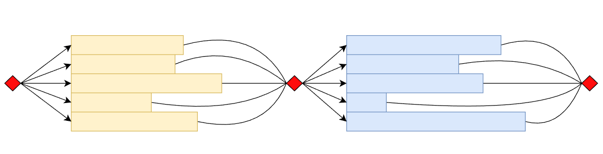

```{r setup, echo=FALSE, include=FALSE}
knitr::knit_hooks$set(optipng = knitr::hook_optipng)
knitr::opts_chunk$set(echo = FALSE,
                      collapse = TRUE,
                      comment = "#>",
                      fig.path = "", #  images are stored in the same directory
                      fig.retina = 2, # Control using dpi
                      fig.width = 6,  # generated images
                      fig.pos = "t",  # pdf mode
                      fig.align = "center",
                      dpi = if (knitr::is_latex_output()) 72 else 300,
                      out.width = "100%",
                      dev = "svg",
                      dev.args = list(png = list(type = "cairo-png")),
                      optipng = "-o7 -quiet")
```

# Abstract

As of today, the hardware usually comes with multi-core architectures.
People need to rely on something other than hardware vendors to improve single-core performance.

> The hardware free-lunch has been over for about 15 years.
>
> --- Herb Sutter [@Sutter05] ---

In order to follow this evolution, one needs to ensure that software is performance-compatible with multi-core machines.
The software industry started with a trend of incorporating concurrency in action.
As expected, ISO C++ has also started providing high-level abstractions for expressing parallelism, moving beyond simple threads and synchronization primitives: In 2017, the C++ standard introduced the so-called parallel algorithms.
In essence, this feature offers parallel versions of the existing STL algorithms.

This article aims to demonstrate the author's subjective opinion on the current status of ***C++ Parallel Algorithms*** [^parallel-symnonym] (as they were introduced in C++17 and are currently present in C++20).
Although adding parallel versions to some STL algorithms is a reasonable improvement, the author disputes that this is not such a significant advancement as one might think.

[^parallel-symnonym]: The author intercharges ***C++ Parallel STL*** term with ***C++ parallel algorithms***.

# Introduction

Given a context where there is a need to parallelize the following ***transform*** algorithm:

```cpp
std::transform(in.begin(), in.end(), // input range
               out.begin(),          // output range
               ftor                  // transform fun
);
```

Since C++ 17, one could follow the `std::transform` interface and use it as below:

```cpp
std::transform(std::execution::par_unseq, // parallel policy
               in.begin(), in.end(),      // input range
               out.begin(),               // output range
               ftor                       // transform fun
);
```

The difference versus the traditional invocation of `transform` is the first parameter for setting up parallel policy hints.
This parameter tells the algorithm to use parallelization and vectorization in the given case.

The official term for this param is ***Execution Policy*** [^execution-policy] [^stl-parallel-explaination-refs].
It suggests the type of execution for the algorithm.
As of current ISO C++ (C++ 23), there are four parallel policies:

- `seq`\
An instance of `std::sequenced_policy`.
It uses the sequential version of the algorithm. The "classic" version of STL algorithms (no Execution Policy param) is also supposed to be the same as this one.
- `par`\
An instance of `std::parallel_policy`.
The algorithm is allowed to parallelize but disallowed to vectorize.
- `par_unseq`\
Instance of `std::parallel_unsequenced_policy`.
The algorithm can be both parallelized and vectorized.
- `unseq`\
Instance of `std::unsequenced_policy`.
The algorithm is allowed to vectorize but disallowed to parallelize.

Therefore, the parallelizing effort is minimal.
One could specify the parallel policy to transform an existing STL algorithm into a parallel (or vectorized) version.

However, STL algorithm implementations only considered the Execution Policy as a hint or the maximum parallelization/vectorization level allowed.
They can ignore it and fall back to the serial execution entirely.

Currently, most STL algorithms can take the Execution Policy parameter as an instruction to run in parallel.
Several new algorithms were added to overcome the constraints of existing algorithms that forbid parallelizing them or that there are better ways to express some parallel algorithms (`reduce`, `exclusive_scan`, `inclusive_scan`, `transform_reduce`, `transform_exclusive_scan`, `transform_inclusive_scane`).

This article primarily focuses on parallel execution (`par` policy), which aims to utilize all the available cores to increase efficiency.
Nonetheless, the author briefly touches on vectorization (`unseq` policy) towards the end of the article [^vectorization-is-ok].

[^execution-policy]: According to ISO C++ 20 [@iso-cpp-20]:

      - `std::sequenced_policy`\

      > The execution policy type used as a unique type to disambiguate parallel algorithm overloading and require that a parallel algorithm's execution may not be parallelized.
      The invocations of element access functions in parallel algorithms invoked with this policy (usually specified as `std::execution::seq`) are indeterminately sequenced in the calling thread.

      - `std::parallel_policy`\

      > The execution policy type used as a unique type to disambiguate parallel algorithm overloading and indicate that a parallel algorithm's execution may be parallelized.
      The invocations of element access functions in parallel algorithms invoked with this policy (usually specified as `std::execution::par`) are permitted to execute in either the invoking thread or in a thread implicitly created by the library to support parallel algorithm execution.
      Any such invocations executing in the same thread are indeterminately sequenced with respect to each other.

      - `std::parallel_unsequenced_policy`\

      > The execution policy type used as a unique type to disambiguate parallel algorithm overloading and indicate that a parallel algorithm's execution may be parallelized, vectorized, or migrated across threads (such as by a parent-stealing scheduler).
      The invocations of element access functions in parallel algorithms invoked with this policy are permitted to execute in an unordered fashion in unspecified threads, and unsequenced with respect to one another within each thread.

      - `std::unsequenced_policy`\

      > The execution policy type used as a unique type to disambiguate parallel algorithm overloading and indicate that a parallel algorithm's execution may be vectorized, e.g., executed on a single thread using instructions that operate on multiple data items.

[^stl-parallel-explaination-refs]: [@Lelbach16; @Filipek17a; @Filipek17b; @ONeal18] provided comprehensive introduction and explanation of C++ parallel algorithms.

[^vectorization-is-ok]: In order to efficiently use vectorization without global parallelism design, one typically must focus on the local computations. The local-focus approach is perfect for applying vectorization at the STL algorithms level: It can unlock a more significant portion of the computation power available on modern hardware [@Parent16].

# Difficulty in current C++ Parallel Algorithms design

## No Concurrency awareness

The first thing to notice is that it is straightforward to adapt existing algorithms and make them parallel.
This improvement explains the success of parallel algorithms (at least at the perception level).

Despite the C++ committee not intending to solve the concurrency problem with STL Parallel (they wanted to solve local efficiency problems), it also has a negative effect from a didactical point of view [^parallelism-discuss-only].
C++ parallel algorithms have not allowed a global concurrency design. It allows only local optimizations by making some algorithm calls parallelizable.
It is reasonable, for limited domains, to focus more on efficiency than design, but that is typically different with concurrency.
One must pay attention to the design to get suboptimal efficiency. In other words, multi-core efficiency is a global optimization problem, not a local one.
Considering this, the C++ users might misunderstand that they do not need to pay attention to concurrency issues; One can count on C++ STL to magically resolve them.

This problem is concluded to be the same problem that initially led people to insufficient concurrency design.
Instead of recognizing that concurrency needs an entirely new type of design, the C++ standard tried to apply sequential thinking by adding the ability to run on multiple threads [^synchronization-quadrant].
Dropping the old ways of writing software and adopting a new paradigm is necessary for proper concurrency.

[^parallelism-discuss-only]: The author discusses parallelism, not concurrency. The distinction is well-explained by Pike and Teodorescu [@Pike13; @Teodorescu20c]. In short, Concurrency is a design concern, while parallelism is a run-time efficiency concern.

[^synchronization-quadrant]: This article supports Henney's well-discussion on the synchronization quadrant [@Henney17].

## Not yet completely production-ready

> the overall performance improvement gained by optimizing a single part of a system is limited by the fraction of time that the improved part is actually used
>
> -- Martin Reddy [@Martin2011] --

Based on Amdahl's law [@Amdahl1967; @David1985], one needs to have a significant part of the parallelizable code to have speed improvements from parallelism.
In the case of Parallel STL, one needs to have considerable parts of the application using such algorithms. In other words, the vast majority of the time must be spent on STL algorithms to have relevant performance benefits.

However, not every program consists just of STL algorithm calls.
Currently, many programs have flows that are tough to reduce to STL algorithms (if it is even possible).
These applications can only expose control flow concurrency, making them unsuitable for using parallel algorithms.
Imagine a context where the application is doing graph processing.
In most cases, no STL algorithms are ready yet to be used.

## Combining STL algorithms introduces sequential behavior

Suppose a context where one needs to call multiple STL algorithms.
If the algorithms were to interact, then they need to be called serially:

```{r fig.cap="STL Algorithms Flow Illustration."}

```

In the above figure, three flow parts are bound to execute sequentially: before the first algorithm, between the algorithm calls, and at the end of the second algorithm.
Moreover, no matter how exemplary the implementation is, the synchronizing and starting tasks need additional time.
Thus, according to Amdahl's law [@Amdahl1967; @David1985], this puts an upper limit on performance improvement.

Nevertheless, whenever the algorithm ends, it must wait for all the threads to finish executing, which reduces the machine's parallelism capacity.
This behavior results from the fact that the work cannot perfectly distribute between threads; several threads process more than others.

To counter this problem, one could do one or more of the following:

- Start algorithms from multiple threads
- Ensure that algorithms have continuations or pipelining, avoiding serially calling algorithms
- Tune the parallel algorithms to ensure the work's dividing.

The first item can be possible outside parallel STL without direct support.
However, the current design of the C++ standard library does not allow one to implement any of the latter.

## Small datasets are not suitable for parallelization

To make it worthwhile to parallelize an algorithm, the execution time of the algorithm needs to be significant [^threshold-hold-for-applying-parallelization].
Teodorescu [@Teodorescu20a] has refocused Amdahl's Law [@Amdahl1967; @David1985] and suggested that the algorithm needs to take more than 100 milliseconds to be beneficial from parallelizing.
Other optimization opportunities could be better helpful if this is not the case.

[^threshold-hold-for-applying-parallelization]:
      > Please excuse my over-generalisation, but it doesn't seem too rewarding to try to parallelize a 100 millisecond algorithm. Obtaining a linear speedup on a 6-core machine would save 83.3 milliseconds on the completion time, and will fully utilise all the cores.
      >
      > -- Lucian Radu Teodorescu [@Teodorescu20a] --

Such algorithms (which have long execution times) either have a sufficiently large number of elements (e.g., millions of elements) in the collection, or the operation given to the algorithm needs to take a long time.
While the latter can be prevalent in many applications, the former (considerable elements) is typically unpopular.

To give an order of magnitude for *numerous elements*, Bartlomiej [@Filipek17b] benchmarked two experiments on a decent high-performance machine.
The first benchmark is a simple transform operation (the functor doubling the value received).
For 100k elements, the execution times decrease from 0.524 to 0.389 seconds.
A 1.3x improvement for six cores machine is not worth parallelizing.
After this test, Bartlomiej writes [@Filipek17b]:

> As you see on the faster machine, you need like 1 million elements to start seeing some performance gains.
On the other hand, on my notebook, all parallel implementations were slower.

The last experiment is a real-world problem: Computing the Fresnel transformation on 3D vectors. The parallelization improvement result is sufficient, an approximate 6x improvement (from 1.697 seconds to 0.283 seconds) for 100k elements. Although these tests are biased, they still present a rough observation: **One needs a significant number of elements (100k) for the performance improvement to be hundreds of milliseconds**.

Consider other benchmarks from the parallel algorithms implementor of Microsoft Visual Studio's standard library, Billy [@ONeal18].
His article illustrates several benchmarks for sorting algorithms.
The experiment contexts use 1 million elements, resulting in less than 100 milliseconds.

To conclude, to see significant performance improvements from parallelizing STL algorithms, containers with a rough order of magnitude of 1 million elements must be made. This condition only happens sometimes.

## STL Algorithms is not tunning-friendly

This problem affects all the STL algorithms.
Thus, the author takes the `sort` algorithm as a running example.
For a few elements, sorting is faster with a linear algorithm than with a parallel one.
Production-ready algorithms typically have a threshold: if the number of elements is below this point, the algorithm calls the serial version.
The cutoff point varies on algorithm implementations.
Intel OneTBB's `parallel_sort` and GNU ``libstdc++`` set this value to `500` [@IntelOneTBB]:

```cpp
//! Sorts the data in [begin,end) using the given comparator
/** The compare function object is used for all comparisons between elements during sorting.
    The compare object must define a bool operator() function.
    @ingroup algorithms **/
template<typename RandomAccessIterator, typename Compare>
    __TBB_requires(std::random_access_iterator<RandomAccessIterator> &&
                   compare<Compare, RandomAccessIterator> &&
                   std::movable<iter_value_type<RandomAccessIterator>>)
void parallel_sort( RandomAccessIterator begin, RandomAccessIterator end, const Compare& comp ) {
    constexpr int min_parallel_size = 500;
    if( end > begin ) {
        if( end - begin < min_parallel_size ) {
            std::sort(begin, end, comp);
        } else {
            parallel_quick_sort(begin, end, comp);
        }
    }
}
```

The value `500` is well-analyzed with primitive type experiments (string, integers, floating-points) by STL vendors before being set as the threshold.
However, one size does not fit all; this cutoff point must be different to sort some complex objects.
Unfortunately, **the C++ standard only aims to support the general purpose and does not allow any customizing of the algorithms**. This leads to suboptimal performance.

Similarly, given a simple `for_each` operation, if the algorithm needs to call a heavy function, it is reasonable to have each element mapped into a task.
However, if the transformation is simple (i.e., an arithmetic operation), creating one task per element is not ideal for performance.
Algorithms may need tuning to adjust different input patterns.

Similarly, let's assume a simple `for_each` operation.
For some cases, if the algorithm needs to call a heavy function, it's ok to have each element mapped into a task.
On the other hand, if the transformation is simple (i.e., an arithmetic operation) then, creating one task per element will be bad for performance.
Thus, algorithms may need tuning to accommodate different input patterns.

Concore library [@concore] showing how one can set hints to parallel algorithms:

```cpp
concore::partition_hints hints;
hints.granularity_ = 100;
// cannot process less than 100 elements in
// a single task
concore::conc_for(input.begin(), input.end(), functor, hints);
```

## Compile time overhead

C++ STL is heavily templatized and needs to be implemented in header files.
Even so, implementing parallel algorithms is far more complicated than serial versions and adds significant compile-time overhead [^parallel-compile-time-overhead].

[^parallel-compile-time-overhead]: Rodgers provided some metrics about this problem in CppCon 2018 [@Rodgers18]

People could not take this problem lightly since it takes more time to compile C++ programs. Especially when applying Test-Driven-Development in the project, compilation cycles take forever to compile.

Fortunately, there are a few tricks that both implementers can employ to save part of this problem.
Jorg introduced several techniques to reduce compile time costs in CppCon 2019 [@Jorg19].
For example, GCC will not compile the parallel versions of the library if `<execution>` is not included [@Rodgers18].

# Conclusion

C++ parallel STL brings parallelization and vectorization to standard algorithms without requiring much effort from the user.
However, the author considered this feature under-expected and needs better support.

Firstly, moving to multi-core programming requires a global concurrency design.
C++ parallel algorithms do not offer any support for this.
Moreover, the standard (accidentally) misguide to C++ users that parallelism can be easily achieved without concurrent understanding.

Secondly, besides the high-level concurrency design issue, the standard parallel library also has limitations at the low level.
As applications have more than just algorithms, using standard C++ parallel algorithms is insufficient to achieve good speedups for most applications.
The article covers several problems related to lower-level performance issues:

- STL algorithms are serialized.
- Typically, Small datasets are unsuitable for parallelization
- Impossibility of tuning the algorithms.
- Compile time overhead.

It is true that it's easy for a user to quickly change the policy of the STL algorithms and maybe get some performance benefits.
But my focus in this article is on the empty half of the glass.
I'm arguing that the benefits are not as big as one could obtain with a proper concurrency design.
In some limited cases (i.e., many elements, or functors that are too complex) one might get some speedups for one's algorithms.
But even in these cases, the costs of spiking into using multiple cores may have an overall negative performance costs.

All these make C++ parallel algorithms less of a great addition to the concurrency frameworks.
The author agrees that they are needed, but it is still insufficient.
The basic executor concept would have been a better complement to the standard.
Unfortunately, the executors did not make it to C++ 23.
So, let people wait to see what the future will reserve.

# Appendix

# References
