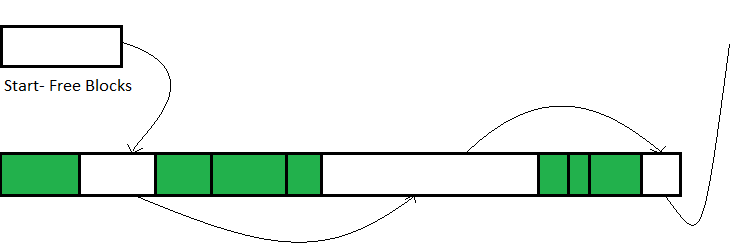

# 1 Introduction

When it comes to memory usage, there are (typically) two types of
programs. The first type is programs that **allocate memory in large
blocks**. Usually, they know **precisely how much memory they will need
and can allocate it in advance**. Usually, these programs create a
monolith of memory with a fixed size (e.g.&nbsp;holding their memory in
arrays or vectors) and typically access it linearly (but only sometimes
so). These programs might even use dynamic memory, but when they do,
they commonly call `malloc` only a few times during the program&rsquo;s
lifetime. In other words, memory allocation and memory organization are
not typically limiting factors in these programs.

The second type of program, which is more well-known to us, uses memory
differently. For development reasons (e.g.&nbsp;scalability or
security), it is not straightforward to calculate how many resources a
program of this type will need. Thus, they might use data structures or
message passing, which require allocating a mass of small memory chunks
(using `malloc`). Accordingly, the number of allocation/deallocation
requests is much more than the former type.

Programs indeed need to spend time on memory allocation. However, for
performance-crucial programs, it may raise a performance bottleneck
issue. One should investigate if the allocation time is notably long.

Please note that there are two things to consider when talking about the
performance of dynamic memory usage:

- **Memory Allocation Speed**: depends mostly on how exemplary the
  implementations of `malloc` or `free` are.
- **Allocator Access Speed**: depends on hardware memory subsystems.
  Some system allocators are better at allocating memory in a way that
  benefits hardware memory subsystems.

**This post focuses on allocation speed, demonstrates the causes of
memory allocation/deallocation sluggishness, and suggests a
(comprehensive) technique list on how to speed up critical places**. The
**access speed** will be the topic of a follow-up post.

# 2 Drawbacks of `malloc` and `free` design

Because `malloc` and `free` are parts of the C standard[^1], C/C++
compiler vendors have implemented them based on The C Standard Library
guideline. Undoubtedly, these functions meet all the requirements for
general purposes. However, when talking about performance-critical
software, they are usually the first thing individual want to replace.

[^1]: At the time of writing, C17 standard [\[1\]][1], [\[2\]][2] has
    stated the definitions of `malloc` and `free` functions:

    - 7.22.3.4 The malloc function (p: 254)
    - 7.22.3.3 The free function (p: 254)

  [1]: #ref-iso-c-17
  [2]: #ref-iec-c-17

## 2.1 Memory fragmentation

For most scenes, the allocator demands large blocks of memory from the
OS. From such blocks, the allocator splits out into smaller chunks to
serve the requests made by programs. There are many approaches to
managing these chunks out of a large block. Each algorithm differs in
speed (will the allocation be fast) and memory usage.

<div class="figure" style="text-align: center">


<p class="caption">
Given the already-allocated green chunks, when the allocator needs to
allocate a new chunk, it traverses the list from Free Blocks Start. For
speed optimization, the allocator can return the first chunk of the
appropriate size (first-fit algorithm). For memory consumption, the
allocator can return the chunk whose size most closely matches the
requested size by the calling code (best-fit algorithm).
</p>

</div>

However, **the allocator itself still needs an algorithm and takes time
to find an appropriate memory block of a given size**. Moreover, it gets
more challenging to find the block over time. The reason for this is
called memory fragmentation.

Given the following scenario, the heap consists of 5 chunks. The program
allocates all of them, and after a time, it returns chunks 1, 3 and 4.

<div class="figure" style="text-align: center">


<p class="caption">
Memory Fragmentation Illustration. Each block is 16 bytes in size. Green
blocks are marked as allocated, and red blocks are available.
</p>

</div>

In the above example, when the program requests a chunk of size 32 bytes
(2 consecutive 16-byte chunks), the allocator would need to traverse to
find the block of that size since it is available at 3 and 4. Suppose
the program wants to allocate a block of size 48 bytes. In that case,
the allocator will fail because it cannot find a subset of contiguous
chunks. However, there are 48 bytes available in the large block (blocks
1, 3 and 4).

Therefore, **as time passes, the `malloc` and `free` functions get
slower because the block of appropriate size is harder to find**.
Moreover, the allocation may fail for large block requests if a
continuous chunk with the requested size is unavailable (even though
there is enough memory in total).

**Memory fragmentation is a severe problem for long-running systems**.
It causes programs to become slower or run out of memory. For example,
given a TV Box, the user changes a channel every 5 seconds for 48 hours.
In the beginning, it took 1 second for the video to start running after
changing the channel. Then after 48 hours, it took 7 seconds to do the
same. It is memory fragmentation.

## 2.2 Thread Synchronization

For multi-threaded programs (typical for nowadays), **`malloc` and
`free` are required to be thread-safe**[^2]. The simplest way a C/C++
library vendor can implement them thread-safe is to introduce mutexes to
protect the critical section of those functions. However, it comes with
a cost: mutex locking/unlocking are expensive operations on
multi-processor systems[^3]. **Synchronization can waste the speed
advantage, even how quickly the allocator can find a memory block of
appropriate size**.

[^2]: According to the C17 standard [\[1\]][\[1\]1], [\[2\]][\[2\]2]:

    > `free` is thread-safe: it behaves as though only accessing the
    > memory locations visible through its argument, and not any static
    > storage.  
    > A call to `free` that deallocates a region of memory
    > **synchronizes-with** a call to any subsequent allocation function
    > that allocates the same or a part of the same region of memory.
    > This synchronization occurs after any access to the memory by the
    > deallocating function and before any access to the memory by the
    > allocation function. There is a single total order of all
    > allocation and deallocation functions operating on each particular
    > region of memory.

    > `malloc` is thread-safe: it behaves as though only accessing the
    > memory locations visible through its argument, and not any static
    > storage.  
    > A previous call to `free` or `realloc` that deallocates a region
    > of memory synchronizes-with a call to malloc that allocates the
    > same or a part of the same region of memory. This synchronization
    > occurs after any access to the memory by the deallocating function
    > and before any access to the memory by malloc. There is a single
    > total order of all allocation and deallocation functions operating
    > on each particular region of memory.

[^3]: Stackoverflow user &ldquo;Dummy00001&rdquo; has explained that the
    primary overhead of mutexes is from the memory/cache coherency
    guarantees [\[3\]][3]. In the same article, the user &ldquo;Carlo
    Wood&rdquo; has also benchmarked the number of clocks it takes to
    lock/unlock mutex on a decent multi-core machine and gave favorable
    results with &ldquo;Dummy00001&rdquo;&rsquo;s statement[\[4\]][4].

  [\[1\]1]: #ref-iso-c-17
  [\[2\]2]: #ref-iec-c-17
  [3]: #ref-mutex-lock-cost-explain
  [4]: #ref-mutex-lock-cost-benchmark

Several allocators have guaranteed the performance in
multi-threaded/multi-processor systems to resolve this issue. In
general, the main idea is to make it synchronization-free if the memory
block is exactly accessed from a single thread. For example, reserving
per-thread memory or maintaining per-thread cache for recently used
memory chunks.

The above strategy works well for most of the use cases. Nonetheless,
the runtime performance can be awful when the program allocates and
deallocates memory in different threads (worst-case). Furthermore, this
strategy generally increases program memory usage.

# 3 Program slowness caused by allocators

In overview, there are three main reasons which come from allocators
that slow down the program:

- **Massive demand on the allocator**: Enormous memory chunk requests
  will limit the program&rsquo;s performance.

- **Memory fragmentation**: The more fragmented memory is, the slower
  `malloc` and `free` are.

- **Ineffective allocator implementation**: Allocators by C/C++ Standard
  Library are for general purposes but not ideal for
  performance-critical programs.

Resolving any of the above causes should make the program faster (in
principle). These mentioned reasons are not entirely independent of each
other. For example, reducing memory fragmentation can also be fixed by
decreasing the pressure on the allocator.

# 4 Optimization Strategies

According to Donald Knuth [\[5\]][5]:

  [5]: #ref-premature-optimization

> &ldquo;We should forget about small efficiencies, say about 97% of the
> time: premature optimization is the root of all evil. Yet we should
> not pass up our opportunities in that critical 3%&rdquo;

**One should consider profiling and benchmarking the program to find the
root cause of slowness before optimizing**. The following sections
present effective techniques to reduce dynamic memory consumption and
fasten runtime performance. They are suggestions for fine-tuning the
applications. They do not provide or propose techniques to rewrite the
program more efficiently.

## 4.1 Contiguous containers of pointers

In C++, polymorphism can be achieved by using vectors of pointers (e.g.,
`vector<T*>` or `vector<unique_ptr<T>>`). However, this solution puts
massive pressure on the system allocator: **creating/releasing an
element(pointer) in the vector results in a call to `new` (`malloc`)**.

Large vector(s) of pointers will lead to degradation in speed
performance as the data set grows because of the demand pressure on the
allocator and memory fragmentation.

**An approach for this issue is using a pointer of a vector of objects
(e.g., `vector<T>*` or `unique_ptr<vector<T>>`)**. This usage ensures
all the elements in a continuous block, improves data locality, and
drastically decreases the number of calls to the system allocator.

However, this solution seems verbose since it can only work for a single
type. Fortunately, several C++ polymorphism libraries have been built to
resolve real-world problems. A fitting example is [**proxy**][] from
Microsoft. It is an open-source, cross-platform, single-header library
for the purpose of making runtime polymorphism easier to implement and
faster. Wang [\[6\]][6] has posted a detailed introduction on how to use
the library.

  [**proxy**]: https://github.com/microsoft/proxy
  [6]: #ref-ms-proxy

## 4.2 Custom STL Allocator

STL data structures like trees (e.g.&nbsp;`set` and `map`), hash maps
(e.g.&nbsp;`unordered_set` and `unordered_map`), and vectors of pointers
**make many requests for memory chunks from the allocator**,
increasesing memory fragmentation and, as a consequence, decreases the
performance.

**Fortunately, STL data structures accept a user-specified `Allocator`
as one of the template arguments**. These structures call `allocate` to
request memory and `deallocate` to release the unneeded memory from the
`Allocator`. Users can specify custom `Allocator` (by implementing these
functions and satisfying the **STL `Allocator` requirements**[^4]) for
their own needs.

[^4]: A summary of C++20 Standard `Allocator` requirements [\[7\]][7],
    [\[8\]][8] can be found at [cppreference][]

  [7]: #ref-iso-cpp-20
  [8]: #ref-iec-cpp-20
  [cppreference]: https://en.cppreference.com/w/cpp/named_req/Allocator#Requirements

### 4.2.1 STL Allocators - Per-Type Allocator

According to [cppreference][9], issued in 01/02/2023, the C++20 Standard
[\[7\]][\[7\]7], [\[8\]][\[8\]8] has stated that:

  [9]: https://en.cppreference.com/w/cpp/named_req/Allocator#Stateful_and_stateless_allocators
  [\[7\]7]: #ref-iso-cpp-20
  [\[8\]8]: #ref-iec-cpp-20

> Every `Allocator` type is either **stateful** or **stateless**.
> Generally, a **stateful** allocator type can have unequal values which
> denote distinct memory resources, while a **stateless** allocator type
> denotes a single memory resource.

Given `std::allocator` and `CustomStatelessAllocator` are stateless
allocators, `CustomStatefulAllocator` is a stateful allocator. Consider
the following information:

``` cpp
std::vector<char> vector_a;
std::vector<char, std::allocator<char>> vector_b;
std::vector<char, CustomStatelessAllocator<char>> vector_c;
std::vector<char, CustomStatefulAllocator<char>> vector_d;

std::set<char> set_a;
std::set<char, std::less<char>, std::allocator<char>> set_b;
std::set<char, std::less<char>, CustomStatelessAllocator<char>> set_c;
std::set<char, std::less<char>, CustomStatefulAllocator<char>> set_d;

std::map<char, bool> map_a;
std::map<char, bool, std::less<char>,
         std::allocator<std::pair<const char, > bool>>
    map_b;
std::map<char, bool, std::less<char>,
         CustomStatelessAllocator<std::pair<const char, bool>>>
    map_c;
std::map<char, bool, std::less<char>,
         CustomStatefulAllocator<std::pair<const char, bool>>>
    map_d;
```

| instance   | allocator                                                 | group |
|------------|-----------------------------------------------------------|-------|
| `vector_a` | `std::allocator<char>` (defaulted)                        | 1     |
| `vector_b` | `std::allocator<char>`                                    | 1     |
| `vector_c` | `CustomStatelessAllocator<char>`                          | 2     |
| `vector_d` | `CustomStatefulAllocator<char>`                           | 3     |
| `set_a`    | `std::allocator<char>` (defaulted)                        | 1     |
| `set_b`    | `std::allocator<char>`                                    | 1     |
| `set_c`    | `CustomStatelessAllocator<char>`                          | 2     |
| `set_d`    | `CustomStatefulAllocator<char>`                           | 3     |
| `map_a`    | `std::allocator<std::pair<const char, bool>>` (defaulted) | 4     |
| `map_b`    | `std::allocator<std::pair<const char, bool>>`             | 4     |
| `map_c`    | `CustomStatelessAllocator<std::pair<const char, bool>>`   | 5     |
| `map_d`    | `CustomStatefulAllocator<std::pair<const char, bool>>`    | 6     |

From the results, it is evident that **`std::allocator` is per-type
allocators**: all the data structures of the same type share one
instance of the allocator.

#### 4.2.1.1 Design Overview

In a regular allocator, memory chunks belonging to different data
structures may end up next to one another in the memory. With an STL
allocator, data from different domains are guaranteed in separate memory
blocks. This design leads to several improvements:

- **Since data from the same data structure is in the same memory block,
  it not only decreases memory fragmentation but also increases data
  locality and access speed:**
  - STL allocator guarantees that memory chunks are returned to the
    allocator when the data structure is destroyed. Additionally, when
    all data structures of the same type are destroyed, the STL
    allocator returns the free memory to the system.
  - Consecutive calls to `allocate` and `deallocate` guarantee to return
    neighboring chunks in memory
- **Simple implementation opens up speed opportunities**:
  - **The allocator return only chunks of a (or multiple of) constant
    size**: memory-fragmentation-free. Any free element will be a
    perfect fit for any request.  
    Also, since the size is already known (constant size), there is no
    need for chunk metadata that keeps the information about the
    chunk&rsquo;s size.
  - **No thread-safe requirements** unless the data structure is
    allocated from several threads.

#### 4.2.1.2 Example of customizing STL allocator

**Arena Allocator**[^5] is commonly used for data structures with little
changes after creation. Since deallocation is a no-op, destruction can
be significantly fast.

[^5]: **Region-based memory management**[\[9\]][10] is a type of memory
    management in which each allocated object is assigned to a region.
    The region (also known as the arena) is a collection of allocated
    objects that can be efficiently reallocated or deallocated all at
    once. Like stack allocation, regions facilitate the allocation and
    deallocation of memory with low overhead. However, they are more
    flexible, allowing objects to live longer than the stack frame in
    which they were allocated. In typical implementations, all objects
    in a region are allocated in a single contiguous range of memory
    addresses, similar to how stack frames are typically allocated.

  [10]: #ref-region-based-memory-management

This section provides a naive **Arena Allocator** implementation for
`std::map`.

Given the definition of C++20 `std::map` [\[8\]][\[8\]8], issued in
01/02/2023 from [cppreference][11]:

  [\[8\]8]: #ref-iec-cpp-20
  [11]: https://en.cppreference.com/w/cpp/container/map

``` cpp
template<
    class Key,
    class T,
    class Compare = std::less<Key>,
    class Allocator = std::allocator<std::pair<const Key, T>>
> class map;
```

There is a template parameter named `Allocator`, and it defaults to
`std::allocator` (line 5). One can replace the default allocator by
writing a class with a few methods that can replace the
`std::allocator`.

Suppose a context uses `std::map` to look up a considerable number of
elements, then destroy it as soon as afterwards. One can provide a
custom allocator that allocates from one specific block. Follow the
below example:

``` cpp
template <typename T>
class arena_allocator {
public:
  arena_allocator() {
    memory_ = reinterpret_cast<T*>(mmap(0, kMemorySize, PROT_READ | PROT_WRITE,
                                         MAP_PRIVATE | MAP_ANONYMOUS, -1, 0));
    free_block_index_ = 0;
  }

  ~arena_allocator() {
    munmap(memory_, kMemorySize);
  }

  // ....

  [[nodiscard]] constexpr T* allocate(std::size_t n) {
    T *result = &memory_[free_block_index_];
    free_block_index_ += n;
    return result;
  }

  constexpr void deallocate(T* p, std::size_t n) {
    // deallocate everything when destroyed
  }

private:
  T* memory_{nullptr};
  int free_block_index_{0};
  static constexpr int kMemorySize{1000 * 1024 * 1024};
};

// using the custom allocator
std::map<int, my_class, std::less<int>,
         arena_allocator<std::pair<const int, my_class>>>
    my_ds;
```

On line 5, call `mmap` to allocate a large memory block from the OS (it
will not allocate all that RAM unless the program uses it). When the
`arena_allocator` instance is destroyed (line 11), the block will get
returned to the system. Method `allocate` returns the block&rsquo;s
first available chunk (lines 17-19), and method `deallocate` does
nothing. Therefore, the allocation is fast, and deallocating is a no-op.

This approach is ideal for the scene where allocating a complete
`std::map` at the beginning and then does not do any removal operations.
The tree (`std::map` is usually implemented as a red-black tree) will be
compact in memory, which is suiteable for the cache-hit rate and
performance. It will make no memory fragmentation since the whole block
is separated from other memory blocks.

When removing elements from `std::map`, even though `std::map` would
call `deallocate`, no memory would be released. The program&rsquo;s
memory consumption would go up. If this is the case, one might need to
implement the `deallocate` method, but allocation also needs to become
more complex.

### 4.2.2 Per-Instance Allocator

**Per-Instance Allocator** is ideal when having several large data
structures of the same type. By using it, the memory needed for a
particular data structure instance will be allocated from a dedicated
block instead of separating memory blocks per domain (allocating a
memory pool for each type).

Take an example of `std::map<student_id, student>`, given having two
instances, one for undergraduate students and the other for graduate
students. With standard STL allocators, both hash maps share the same
allocator. With a per-instance allocator, when destroying an instance,
the whole memory block used for that instance is empty and can be
directly returned to the OS. This benefits memory fragmentation
reduction and data locality increment (faster map traversal).

**Unfortunately, STL data structures do not support per-instance
allocators. Thus, rewriting the data structure with
per-instance-allocator support is indeed a need**.

### 4.2.3 Tuning the custom allocator

**A custom allocator can be adjusted to a specific environment for
maximum performance**. The following approaches can be taken into
account when choosing the right strategy for an individual&rsquo;s
custom allocator:

- **Static allocator**: Preloading with enough space to store elements
  can be perfectly fit for small data structures. If the context
  requires extra memory, the allocator can request it from the system
  allocator. This approach can substantially decrease the number of
  calls to the system allocator.
- **Arena allocator**: Releasing memory only when the allocator is
  destroyed. It is helpful for large data structures that are primarily
  static after creation.
- **Cache allocator**: When deallocating, keep specific chunks in the
  cache instead of returning the whole memory to the system allocator
  for future usage of allocating requests. Despite not decreasing memory
  fragmentation, this approach can slow down fragmenting progression.

## 4.3 Memory chunk caching for producer-consumer

Take an example where a producer thread allocates an object and sends it
to the consumer thread. After processing, the consumer thread destroys
the object and releases the memory back to the OS. **This context puts
significant pressure on the system allocator. One approach is to
allocate all the objects from a dedicated memory pool using a custom
allocator.**

In C++, one could overload the `operator new/delete` to use the new
allocator. However, synchronisation must be aware since the object
memory lifetime is controlled in separate threads. One idea is to use a
memory cache on both the allocation and deallocation places. Consider
the following source code:

``` cpp
template <typename T>
class memory_pool {
public:
  T* allocate() {
    if (allocation_cache_.empty()) {
      int move_count{};
      int remaining_count{};

      common_cache_mutex_.lock();
      move_count =
          allocation_cache_.move_to(common_cache_, allocation_cache_.capacity());
      common_cache_mutex_.unlock();

      remaining_count = allocation_cache_.capacity() - move_count;
      for (auto i = 0; i < remaining_count; ++i) {
        allocation_cache_.push_front(malloc(sizeof(T)));
      }
    }

    return allocation_cache_.pop_front();
  }

  void deallocate(T* p) {
    if (deallocation_cache_.full()) {
      int remaining_count{};

      common_cache_mutex_.lock();
      common_cache_.move_to(deallocation_cache_, deallocation_cache_.capacity());
      common_cache_mutex_.unlock();

      remaining_count = deallocation_cache_.count();
      for (auto i = 0; i < remaining_count; ++i) {
        free(deallocation_cache_.pop_front());
      }
    }

    deallocation_cache_.push_front(p);
  }

private:
  chunk_list<T*> allocation_cache_;
  chunk_list<T*> deallocation_cache_;
  chunk_list<T*> common_cache_;
  std::mutex common_cache_mutex_;
};

// Usage

class object {
public:
  void* operator new(size_t size) {
    return m_pool.allocate();
  }

  void operator delete(void* p) {
    m_pool.deallocate(p);
  }
private:
  static memory_pool<object> m_pool;
};
```

Inside the custom allocator `memory_pool`are three linked lists
containing the cached memory chunks: `allocation_cache_`,
`common_cache_` and `deallocation_cache_`.

- **When `deallocate` is called, the memory chunk is not released back
  to the system allocator. Instead, it is cached** (line 37).
  - If `deallocation_cache_` is full, memory chunks from it are moved to
    `common_cache_`(line 28). When the `common_cache_` becomes full, the
    remaining memory chunks are released back to the system allocator
    (lines 32-34). `deallocation_cache_` is empty after this operation.
  - Access to `common_cache_` has to be secured with a mutex (lines 27
    and 29).
  - Access to `deallocation_cache_` is the typical case.`memory_pool`
    only need to access `common_cache_` when `deallocation_cache_` is
    full.
- **When `allocate` is called, if available, a memory chunk is taken
  from the cache** (line 20).
  - If `allocation_cache_` is empty, additional memory chunks are taken
    from the `common_cache_`(line 10). The `memory_pool` will move
    chunks (as much as possible) from the `common_cache_` to the
    `allocation_cache_`until `allocation_cache_` is full.
  - If the `allocation_cache_` is not filled after this operation, the
    system allocator will request additional memory chunks (lines
    15-17).
  - Access to `common_cache_` has to be secured with a mutex (lines 9
    and 12).
  - Access to `allocation_cache_` is the regular case. `memory_pool`
    only need to access `common_cache_` when `allocation_cache_` is
    empty.

This solution works only with two threads, one allocates, and the other
deallocates objects.

For optimally, the size of `allocation_cache_`, `deallocation_cache_`
and `common_cache_` need to be chosen carefully:

- Using small values forces the `memory_pool` to work more with the
  system allocator than the cached chunk lists.
- Using large values causes the `memory_pool` to consume more memory.
- An ideal size for `common_cache_` is about two times bigger than the
  capacity of the others.

## 4.4 Small Size Optimizations

Given the class `small_vector` for storing integers with the following
(naive) implementation:

``` cpp
class small_vector {
public:
  small_vector(size_t capacity) {
    size_ = 0;
    capacity_ = capacity;
    data_ = malloc(sizeof(int) * capacity);
  }
  int& operator[](size_t index) {
    return data_[index];
  }

private:
  int* data_;
  size_t size_;
  size_t capacity_;
};
```

Suppose the profiling report shows that in most of the runtime cases,
these objects have small sizes of up to 4. **A solution could be
pre-allocating four integers, thus, totally reducing calls to the system
allocator**:

``` cpp
class small_vector {
public:
  small_vector(size_t capacity) {
    size_ = 0;
    if (capacity <= kPreAllocatedSize) {
      capacity_ = kPreAllocatedSize;
      data_ = pre_allocated_storage_;
    } else {
      capacity_ = capacity;
      data_ = malloc(sizeof(int) * capacity);
    }
  }
  // ...
private:
  // ...
  static constexpr int kPreAllocatedSize = 4;
  int pre_allocated_storage_[kPreAllocatedSize];
};
```

The above codes illustrate creating a `small_vector` with a capacity
less than or equal to `kPreAllocatedSize` (lines 6-7) for ordinary use
cases by using `pre_allocated_storage_`. Otherwise, call the system
allocator as the origin implementation (lines 9-10).

However, the drawback is the class size increment. On a 64-bit system,
the original was 24 bytes, while the new is 40 bytes.

**A common solution is using C unions to overlay the data for the
pre-allocated case and the heap-allocated case**. The most significant
bit in `size_` can be used for authorization between these cases (`0`
for pre-allocated and `1` for heap-allocated).

``` cpp
class small_vector {
public:
  small_vector(size_t capacity) {
    if (capacity > kPreAllocatedSize) {
      data_.heap_storage_.capacity_ = capacity;
      data_.heap_storage_.data_ = (int*)malloc(sizeof(int) * capacity);
      size_ = 0 | kHeadSizeMask;
    } else {
      size_ = 0;
    }
  }

  bool is_pre_allocated() {
    return (size_ & kHeadSizeMask) == 0;
  }

  int& operator[](size_t index) {
    if (is_pre_allocated()) {
      return data_.pre_allocated_storage_[index];
    }

    return data_.heap_storage_.data_[index];
  }

  size_t size() {
    return size_ & (~kHeadSizeMask);
  }

private:
  static constexpr int kPreAllocatedSize = 4;
  static constexpr size_t kHeadSizeMask = 1ULL << (sizeof(size_t) * 8 - 1);
  union data_t {
    struct {
      int* data_;
      size_t capacity_;
    } heap_storage_;
    int pre_allocated_storage_[kPreAllocatedSize];
  };
  data_t data_;
  size_t size_;
};
```

This approach is used in several places. For example, **libc++
`std::string` implementation**[^6].

[^6]: The implementation of **libc++ `std::string`** can be found at
    their [repository][]. Unfortunately, the source code is hard to read
    and undocumented. Laity [\[10\]][12] has posted an overview of their
    design and optimisation for this implementation

  [repository]: https://github.com/llvm/llvm-project/blob/main/libcxx/include/string
  [12]: #ref-libcpp-implementation

## 4.5 Fighting memory fragmentation

It is always challenging to reduce memory fragmentation or make it never
happens. Sometimes, it is caused by the system. There are a few
approaches that can help in these situations:

- **Restart**: some systems will occasionally restart to avoid memory
  fragmentation. However, creating a restartable or state-restorable
  program or system can be challenging.

- **Pre-allocate memory upfront**: Some programs pre-allocate all the
  needed memory at the start and then completely dispense with dynamic
  memory allocation. MISRA coding guidelines even forbids the usage of
  dynamic memory in the automotive industry:

  > MISRA C++ 2008 [\[11\]][13], 18-4-1 - Dynamic heap memory allocation
  > shall not be used.

  > MISRA C:2004 [\[12\]][14], 20.4 - Dynamic heap memory allocation
  > shall not be used.

  > MISRA C:2012 [\[13\]][15], 21.3 The memory allocation and
  > deallocation functions of \<stdlib.h\> shall not be used

  However, these guidelines are impossible for programs in other
  industries where the needed memory is unknown at the beginning of the
  program.

- **Changing the system allocator**: several system allocators can be
  used instead of the built-in one and which promise faster allocation
  speed, better memory usage, less fragmentation, or better data
  locality.

  [13]: #ref-misra-cpp-2008
  [14]: #ref-misra-c-2004
  [15]: #ref-misra-c-2012

# 5 System Allocators

This section describes a solution to speed up programs by using a better
system allocator for individual needs. Several open-source allocators
try to achieve efficient allocation and deallocation. Despite that,
there has yet to be any allocator who has taken the holy grail.

Regularly, there are four perspectives that each allocator compromises
on:

- **Allocation Speed**: Note that both the speed of `malloc` and `free`
  (`new` and `delete` in C++) are essential.
- **Memory Consumption**: Percentage of wasted memory after allocating.
  The allocator needs to keep some accounting info for each block, which
  generally takes up some space. Additionally, if the allocator
  optimizes for allocation speed, it can leave some memory unused.
- **Memory Fragmentation**: Some allocators have these issues than
  others, which can affect the speed of long-running applications.
- **Cache/Data Locality**: Allocators which pack data in smaller blocks
  and avoid memory losses have better cache/data locality (which will be
  discussed in a follow-up article)

## 5.1 Allocators on Linux

When one does not specify any configurations, the Linux programs use
**GNU Allocator**, based on [**ptmalloc**][]. Apart from it, there are
several other open-source allocators commonly used on Linux:
[**tcmalloc**][] (by Google), [**jemalloc**][] (by Facebook),
[**mimalloc**][] (by Microsoft) and [**hoard allocator**][].

  [**ptmalloc**]: http://www.malloc.de/en/
  [**tcmalloc**]: https://github.com/google/tcmalloc
  [**jemalloc**]: https://github.com/jemalloc/jemalloc
  [**mimalloc**]: https://github.com/microsoft/mimalloc
  [**hoard allocator**]: https://github.com/emeryberger/Hoard

GNU Allocator is not among the most efficient allocators. However, it
does have one advantage, the worst-case runtime and memory usage will be
all right.

Other allocators claim to be better in speed, memory usage, or
cache/data locality. Before choosing a new system allocator, consider
thinking about the following questions:

- Single-thread or multi-threaded?
- Maximum allocation speed or minimum memory consumption? What is the
  acceptable trade-off?
- Is the allocator for the whole program or only the most critical
  parts?

In Linux, after installing the allocator, one can use an environment
variable `LD_PRELOAD` to replace the default allocator with a custom
one:

``` bash
$ LD_PRELOAD=/usr/lib/x86_64-Linux-gnu/libtcmalloc_minimal.so.4
./my_program
```

## 5.2 The Performance Test

Real-world programs differ too much from one another. Therefore,
providing a comprehensive benchmark for allocator performance is
impossible in this article&rsquo;s scope. An allocator performing well
under one load can have different behaviour under another.

&ldquo;No Bugs&rdquo; Hare [\[14\]][16] has compared several allocators
on a test load that tries to simulate a real-world load. According to
the author&rsquo;s conclusion:

  [16]: #ref-it-hare-testing-allocators

> allocators are similar, and testing your particular application is
> more important than relying on synthetic benchmarks.

## 5.3 Notes on using allocators in the program

**All the allocators can be fine-tuned to run better on a particular
system**, but the default configuration should be enough for most use
cases. Fine-tuning can be done through environment variables,
configuration files, or compilation options.

Usually, the allocators provide implementations for `malloc` and `free`,
and replace the functions with the same name provided by the Standard C
Library. This design means the program&rsquo;s dynamic allocation goes
through the new allocator.

However, it is possible to keep default `malloc` and `free`
implementations separately with custom implementations provided by the
chosen allocator. Allocators can provide prefixed versions of `malloc`
and `free` for this purpose (e.g., **jemalloc** with the prefix `je_`).
In this case, `malloc` and `free` will be left unchanged, and one can
use `je_malloc` and `je_free` to allocate memory only for some parts of
the program through `jemalloc`.

# 6 Conclusion

This article represented several optimization solutions for how to
allocate memory faster.

**Ready-made allocators have the benefit of being relatively easy to set
up, and one can see the improvements within minutes**

**Other battle-tested techniques are also powerful when used
correctly**. For example, decreasing allocation requests by avoiding
pointers removes much stress from the system allocator; using custom
allocators can benefit allocation speed and decrease memory
fragmentation.

Lastly, people need to **know their domain and profile the program to
find the root cause of slowness before optimizing, then try multiple
approaches**. Repeating this process is indeed improving the
program&rsquo;s quality.

# 7 Appendix

# 8 References

<div id="refs" class="references csl-bib-body">

<div id="ref-iso-c-17" class="csl-entry">

<span class="csl-left-margin">\[1\]
</span><span class="csl-right-inline">&ldquo;<span class="nocase">Information
technology - Programming languages - C</span>,&rdquo; International
Organization for Standardization; ISO/IEC 9899:2018, International
Standard, Jun. 2018.Available:
<https://www.iso.org/standard/74528.html></span>

</div>

<div id="ref-iec-c-17" class="csl-entry">

<span class="csl-left-margin">\[2\]
</span><span class="csl-right-inline">&ldquo;<span class="nocase">Information
technology - Programming languages - C</span>,&rdquo; International
Electrotechnical Commission; ISO/IEC 9899:2018, International Standard,
Jun. 2018.Available: <https://webstore.iec.ch/publication/63478></span>

</div>

<div id="ref-mutex-lock-cost-explain" class="csl-entry">

<span class="csl-left-margin">\[3\]
</span><span class="csl-right-inline">Dummy00001,
&ldquo;<span class="nocase">How efficient is locking and unlocked mutex?
What is the cost of a mutex?</span>&rdquo; stackoverflow, 2010
\[Online\].Available: <https://stackoverflow.com/a/3652428></span>

</div>

<div id="ref-mutex-lock-cost-benchmark" class="csl-entry">

<span class="csl-left-margin">\[4\]
</span><span class="csl-right-inline">C. Wood, &ldquo;How efficient is
locking and unlocked mutex? What is the cost of a mutex?&rdquo;
stackoverflow, 2019 \[Online\].Available:
<https://stackoverflow.com/a/49712993></span>

</div>

<div id="ref-premature-optimization" class="csl-entry">

<span class="csl-left-margin">\[5\]
</span><span class="csl-right-inline">D. E. Knuth, &ldquo;Structured
programming with go to statements,&rdquo; *ACM Comput. Surv.*, vol. 6,
no. 4, pp. 261&ndash;301, Dec. 1974, doi:
[10.1145/356635.356640][].</span>

</div>

<div id="ref-ms-proxy" class="csl-entry">

<span class="csl-left-margin">\[6\]
</span><span class="csl-right-inline">M. Wang, &ldquo;Proxy: Runtime
polymorphism made easier than ever.&rdquo; Microsoft, 2022
\[Online\].Available:
<https://devblogs.microsoft.com/cppblog/proxy-runtime-polymorphism-made-easier-than-ever/></span>

</div>

<div id="ref-iso-cpp-20" class="csl-entry">

<span class="csl-left-margin">\[7\]
</span><span class="csl-right-inline">&ldquo;<span class="nocase">Programming
languages - C++</span>,&rdquo; International Organization for
Standardization; ISO/IEC 14882:2020, International Standard, Dec.
2020.Available: <https://www.iso.org/standard/79358.html></span>

</div>

<div id="ref-iec-cpp-20" class="csl-entry">

<span class="csl-left-margin">\[8\]
</span><span class="csl-right-inline">&ldquo;<span class="nocase">Programming
languages - C++</span>,&rdquo; International Electrotechnical
Commission; ISO/IEC 14882:2020, International Standard, Dec.
2020.Available: <https://webstore.iec.ch/publication/68285></span>

</div>

<div id="ref-region-based-memory-management" class="csl-entry">

<span class="csl-left-margin">\[9\]
</span><span class="csl-right-inline">M. Tofte and J.-P. Talpin,
&ldquo;Region-based memory management,&rdquo; *Information and
Computation*, vol. 132, no. 2, pp. 109&ndash;176, 1997, doi:
<https://doi.org/10.1006/inco.1996.2613>.</span>

</div>

<div id="ref-libcpp-implementation" class="csl-entry">

<span class="csl-left-margin">\[10\]
</span><span class="csl-right-inline">J. Laity,
&ldquo;<span class="nocase">libc++&rsquo;s implementation of
std::string</span>.&rdquo; joellaity, blog, 2020 \[Online\].Available:
<https://joellaity.com/2020/01/31/string.html></span>

</div>

<div id="ref-misra-cpp-2008" class="csl-entry">

<span class="csl-left-margin">\[11\]
</span><span class="csl-right-inline">Motor Industry Software
Reliability Association, *<span class="nocase">MISRA-C++:2008:
Guidelines for the Use of the C++ Language in Critical Systems</span>*.
MIRA Limited, 2008.Available:
<https://books.google.com.vn/books?id=bNUqPQAACAAJ></span>

</div>

<div id="ref-misra-c-2004" class="csl-entry">

<span class="csl-left-margin">\[12\]
</span><span class="csl-right-inline">Motor Industry Software
Reliability Association, *<span class="nocase">MISRA-C:2004: Guidelines
for the Use of the C Language in Critical Systems</span>*. MIRA,
2004.Available:
<https://books.google.com.vn/books?id=j6oXAAAACAAJ></span>

</div>

<div id="ref-misra-c-2012" class="csl-entry">

<span class="csl-left-margin">\[13\]
</span><span class="csl-right-inline">Motor Industry Software
Reliability Association and Motor Industry Software Reliability
Association Staff and HORIBA MIRA Ltd and HORIBA MIRA Ltd. Staff,
*<span class="nocase">MISRA C:2012: Guidelines for the Use of the C
Language in Critical Systems</span>*. Unknown Publisher, 2019.Available:
<https://books.google.com.vn/books?id=daApxQEACAAJ></span>

</div>

<div id="ref-it-hare-testing-allocators" class="csl-entry">

<span class="csl-left-margin">\[14\]
</span><span class="csl-right-inline">&ldquo;No Bugs&rdquo; Hare,
&ldquo;<span class="nocase">Testing Memory Allocators: ptmalloc2 vs
tcmalloc vs hoard vs jemalloc While Trying to Simulate Real-World
Loads</span>.&rdquo; IT Hare on Soft.ware, blog, 2018
\[Online\].Available:
<http://ithare.com/testing-memory-allocators-ptmalloc2-tcmalloc-hoard-jemalloc-while-trying-to-simulate-real-world-loads/></span>

</div>

</div>

  [10.1145/356635.356640]: https://doi.org/10.1145/356635.356640
