```{r setup, echo=FALSE, include=FALSE}
knitr::knit_hooks$set(optipng = knitr::hook_optipng)
knitr::opts_chunk$set(echo = FALSE,
                      collapse = TRUE,
                      comment = "#>",
                      fig.path = "", #  images are stored in the same directory
                      fig.retina = 2, # Control using dpi
                      fig.width = 6,  # generated images
                      fig.pos = "t",  # pdf mode
                      fig.align = "center",
                      dpi = if (knitr::is_latex_output()) 72 else 300,
                      out.width = "80%",
                      dev = "svg",
                      dev.args = list(png = list(type = "cairo-png")),
                      optipng = "-o7 -quiet")
```


# Introduction

In my opinion, the most captivating demonstrations of performance engineering are from the optimization of textbook algorithms—those that are commonly known and seemingly too simple to warrant any further enhancement. These optimizations, however, prove to be enlightening and offer valuable insights that can be applied across a wide range of contexts. Remarkably, such optimization opportunities are more abundant than one might anticipate.

In this article, we will concentrate our attention on a fundamental algorithm known as ***binary search***. We introduce two variants of this algorithm that exhibit remarkable performance improvements over `std::lower_bound`, with the extent of enhancement dependent on the size of the problem at hand. Astonishingly, these variants achieve speeds up to four times faster:

- The first variant accomplishes this feat by eliminating conditional branches, streamlining the search process and unlocking substantial performance gains.
- The second variant goes a step further by optimizing the memory layout, thereby capitalizing on the full potential of the cache system.

It should be noted, however, that this optimization disqualifies it from serving as a drop-in replacement for `std::lower_bound`, as it necessitates preprocessing and array permutation before queries can be efficiently answered.

The benchmark environment is a moderate personal computer:

- Processor: Intel(R) Xeon(R) CPU E3-1505M v5 @ 2.80 GHz (8 CPUs)
- RAM: 16GB
- Architecture: x86-64
- Compilers: GNU/GCC 13.1 and LLVM/Clang 16.0
- Implementation example: https://godbolt.org/z/r8rfzsv8f

# Summary on Binary Search

Below is the conventional method, commonly found in introductory computer science textbooks, for searching the first element in a sorted array `array` that is not less than a given value `looking_for`:

```c++
auto lower_bound(const std::vector<int32_t>& array, int32_t looking_for)
  -> int32_t {
  size_t l = 0;
  size_t r = array.size() - 1;
  while (l < r) {
    const auto m = (l + r) / 2;
    if (array[m] >= looking_for)
      r = m;
    else
      l = m + 1;
  }
  return array[l];
}
```

The algorithm follows a straightforward approach: it identifies the middle element of the current search range, compares it to the target value looking_for, and then narrows down the search range in half until it becomes invalid.

A similar strategy is utilized by the `std::lower_bound` function, with a slight variation to accommodate containers that have non-random-access iterators. Instead of using the endpoints of the search interval, `std::lower_bound` employs the first element of the container and the size of the search interval to perform the search. This allows for greater flexibility and compatibility with different container types. [LLMV/Clang](https://github.com/llvm/llvm-project/blob/main/libcxx/include/__algorithm/lower_bound.h) and GNU/GCC use this approach as well:

```c++
template <
  class _AlgPolicy,
  class _Iter,
  class _Sent,
  class _Type,
  class _Proj,
  class _Comp>
_LIBCPP_HIDE_FROM_ABI _LIBCPP_CONSTEXPR_SINCE_CXX20 _Iter __lower_bound_impl(
  _Iter __first,
  _Sent __last,
  const _Type& __value,
  _Comp& __comp,
  _Proj& __proj) {
  auto __len = _IterOps<_AlgPolicy>::distance(__first, __last);

  while (__len != 0) {
    auto __l2 = std::__half_positive(__len);
    _Iter __m = __first;
    _IterOps<_AlgPolicy>::advance(__m, __l2);
    if (std::__invoke(__comp, std::__invoke(__proj, *__m), __value)) {
      __first = ++__m;
      __len -= __l2 + 1;
    }
    else {
      __len = __l2;
    }
  }
  return __first;
}
```

If your compiler is sufficiently optimized, it will generate machine code that is comparable in efficiency and exhibits similar average latency.
As we observed from our benchmarking results, the expected latency tends to increase with the size of the array:

```{r}
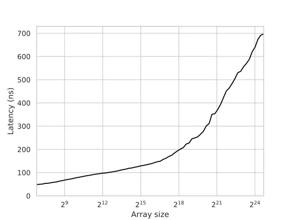
```

Given that most developers do not typically implement binary search manually, we will consider `std::lower_bound` from LLVM/Clang as our baseline for comparison.

## The Peformance Issue

Before delving into the optimized implementations, it is important to understand why binary search can be slow in its standard form.

By analyzing the assembly code of `std::lower_bound` using a performance profiling tool like [perf](https://perf.wiki.kernel.org/index.php/Main_Page), we can observe that a significant amount of time is spent on a **conditional jump** instruction:

```asm
       │35:   mov    %rax,%rdx
  0.52 │      sar    %rdx
  0.33 │      lea    (%rsi,%rdx,4),%rcx
  4.30 │      cmp    (%rcx),%edi
 65.39 │    ↓ jle    b0
  0.07 │      sub    %rdx,%rax
  9.32 │      lea    0x4(%rcx),%rsi
  0.06 │      dec    %rax
  1.37 │      test   %rax,%rax
  1.11 │    ↑ jg     35
```

This **pipeline stall** hinders the progress of the search, and it is primarily caused by two factors:

- **Control Hazard**: The presence of an unpredictable branch (due to independent random queries and keys) forces the processor to pause for 10-15 cycles to flush and refill the pipeline for each branch misprediction.
- **Data Hazard**: The preceding comparison operation must wait for one of its operands to be fetched from memory, which can introduce a delay ranging from 0 to 300 cycles, depending on the location of the operand.

Now, let's explore how we can overcome these obstacles one by one to improve the performance of binary search.

# Technical Contribution

## Removing Branches

We can introduce an optimized version of binary search that replaces branching with predication. To simplify the implementation, we adopt the approach used in the STL and modify the loop to use the first element and the size of the search interval:

```c++
auto lower_bound(const std::vector<int32_t>& array, int32_t looking_for)
  -> int32_t {
  size_t current_index = 0U;
  for (size_t length = array.size(); length > 1;) {
    const auto half = length / 2;
    if (array[current_index + half - 1] < looking_for) {
      current_index += half;
      length -= half;
    }
    else {
      length = half;
    }
  }
  return array[current_index];
}
```

It is worth noting that in each iteration of the binary search algorithm, the variable `length` is effectively halved and then either floored or ceiled, depending on the outcome of the comparison.
This conditional update appears to be unnecessary. To simplify the code, we can assume that `length` is always rounded up (ceiled) instead:

```c++
auto lower_bound(const std::vector<int32_t>& array, int32_t looking_for)
  -> int32_t {
  size_t current_index = 0U;
  for (size_t length = array.size(); length > 1;) {
    const auto half = length / 2;
    if (array[current_index + half - 1] < looking_for)
        current_index += half;
    length -= half; // = ceil(length / 2)
  }
  return array[current_index];
}
```

In this way, it opens improvement chances when we just need to use a ***conditional move*** to update the first element of the search interval and halve the size on each phase:

```c++
auto lower_bound(const std::vector<int32_t>& array, int32_t looking_for)
  -> int32_t {
  size_t current_index = 0U;
  for (size_t length = array.size(); length > 1;) {
    const auto half = length / 2;
    // will be replaced with a "cmov"
    current_index += (array[current_index + half - 1] < looking_for) * half;
    length -= half;
  }
  return array[current_index];
}
```

It is important to note that the modified loop in this implementation is not always equivalent to the standard binary search. Due to the rounding up of the search interval size, it accesses slightly different elements and may perform one comparison more than necessary. However, this modification simplifies the computations in each iteration and ensures a constant number of iterations if the array size remains constant. As a result, it completely eliminates branch mispredictions.

However, it is worth mentioning that this technique, typical for predication, is sensitive to compiler optimizations. Depending on the specific compiler and how the function is invoked, it is possible that a branch may still be present or that suboptimal code may be generated.

In the case of Clang 16, this optimization performs well and provides a significant improvement of 2.5-3x on small arrays:

```{r}
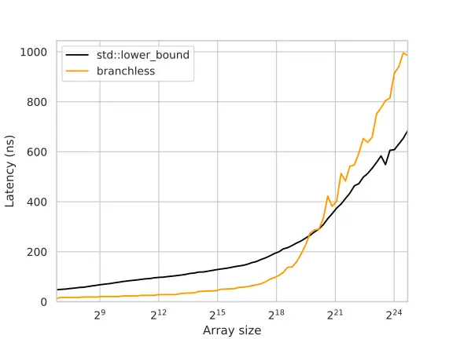
```

An interesting observation is that the branchless implementation performs worse on large arrays, which might seem counterintuitive. Considering that the total delay is primarily determined by RAM latency and that both the branchless and branchy versions perform similar memory accesses, one would expect their performance to be comparable or even slightly better for the branchless version.

However, the key factor behind the better performance of the branchy version lies in the CPU's ability to speculate on one of the branches. With branching, the CPU can start fetching either the left or right key before confirming which one is the correct choice. This speculative execution effectively acts as implicit ***prefetching***, reducing the impact of memory latency.

In contrast, the branchless implementation lacks this speculative behavior since the `cmov` instruction is treated like any other instruction, and the branch predictor does not attempt to predict its operands to anticipate future execution. To compensate for this limitation, we can introduce prefetching by explicitly requesting the left and right child keys:

```c++
auto lower_bound(const std::vector<int32_t>& array, int32_t looking_for)
  -> int32_t {
  size_t current_index = 0U;
  for (size_t length = array.size(); length > 1;) {
    const auto half = length / 2;
    length -= half;
    __builtin_prefetch(&array[current_index + half - 1]);
    __builtin_prefetch(&array[current_index + half * 2 - 1]);
    current_index += (array[current_index + half - 1] < looking_for) * half;
  }
  return array[current_index];
}
```

And now, the performance becomes roughly the same:

```{r}
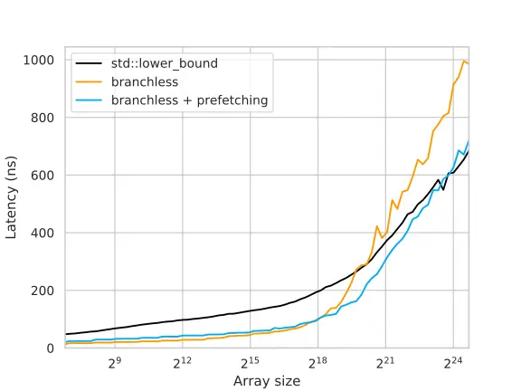
```

Although the explicit prefetching in the branchless version helps improve its performance on large arrays, the graph still shows a faster growth compared to the branchy version. This is because the branchy version takes advantage of speculative execution to prefetch not only the immediate left or right child key but also "grandchildren," "great-grandchildren," and so on. Each additional speculative read, however, becomes exponentially less likely to be correct, diminishing the usefulness of these prefetches.

In the branchless version, it is possible to fetch ahead by more than one layer, similar to the branchy version. However, the number of fetches required would also grow exponentially, which is not a practical solution. Therefore, an alternative approach is needed to optimize memory operations.

## 3.2. Optimizing the Layout

Consider the following illustration:

```{r}
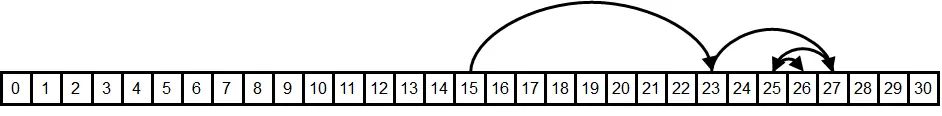
```

The memory access pattern during binary search exhibits specific characteristics that impact the likelihood of elements being cached and the quality of their ***data locality***. Let's examine these aspects in more detail:

- ***Spatial locality*** seems relatively good for the last 3 to 4 requests, as they are likely to be within the same cache line. However, for all the previous requests, there are significant memory jumps, which can lead to poor spatial locality. This means that accessing elements in those requests may result in cache misses, requiring data to be fetched from main memory.
- ***Temporal Locality*** seems to be good for the first dozen of requests. This is because there are not that many different comparison sequences of this length, so the algorithm will repeatedly compare against the same middle elements. These frequently accessed elements are more likely to be cached.

To further understand the importance of temporal locality and its impact on cache performance, an experiment is conducted where the element to compare is randomly chosen from within the search interval, rather than using the middle one.

By introducing randomness, the temporal locality is disrupted, and each comparison may involve different elements. This can lead to cache misses and potentially degrade performance compared to the standard binary search algorithm, where the middle element is consistently used for comparison:

```c++
// gen_random(l, r) will generate random number in [l, r]
// use 32-bit Mersenne Twister and uniform random distribution
auto lower_bound(const std::vector<int32_t>& array, int32_t looking_for)
  -> int32_t {
  size_t l = 0;
  size_t r = array.size() - 1;
  while (l < r) {
    const size_t m = gen_random(l, r);
    if (array[m] >= x)
      r = m;
    else
      l = m + 1;
  }
  return array[l];
}
```

Theoretically [@Gerald1984], the randomized binary search is expected to do 30-40% more comparisons. However the benchmarking result shows ~6x on large arrays:

```{r}
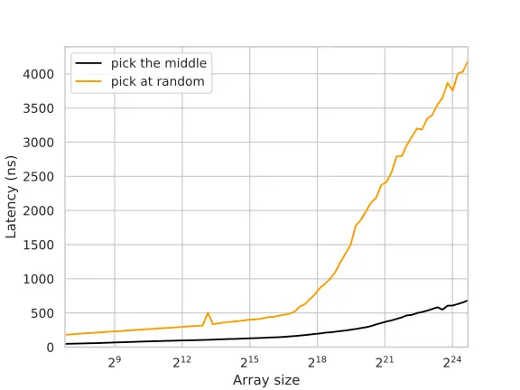
```

The degraded performance in the randomized selection experiment is not solely due to the slow `gen_random()` call.
The drop in performance can be observed at the L2-L3 cache boundary, indicating that the memory latency outweighs the overhead of random number generation and modulo operations. In this case, the performance degradation occurs because the fetched elements are unlikely to be cached, rather than just a small suffix of them.

Another potential negative effect to consider is ***cache associativity***.
If the array size is a multiple of a large power of two, the indices of the frequently accessed elements may be divisible by some large powers of two, resulting in cache conflicts. This can lead to cache thrashing, where elements mapped to the same cache line repeatedly evict each other, negatively impacting performance.
For example, it takes about ~400ns/query for searching over arrays of size $2^{20}$ while searching over arrays of size $(2^{20} + 123)$ takes ~300ns - a 20% difference.

[Fibonacci search](https://en.wikipedia.org/wiki/Fibonacci_search_technique) is one of the way to resolve this problem. However the scope of this article will not talk about it, we are focusing on temporal locality issue. By that, let's ignore any cache side effect by assuming all array sizes are $\lfloor 1.17^k \rfloor$ for integer $k$.

The primary issue with the memory layout is that it does not effectively leverage temporal locality. Specifically, the hot elements (frequently accessed) and cold elements (infrequently accessed) are grouped together in the same cache lines. For instance, the element $\lfloor n/2 \rfloor$, which is requested on each query, is likely stored in the same cache line as $\lfloor n/2 \rfloor + 1$, which is rarely requested. This grouping of hot and cold elements hampers the efficient utilization of temporal locality, leading to potential cache misses and performance degradation.

Given the heatmap that visualize the frequency of comparisons for an array of 31 elements:

```{r}
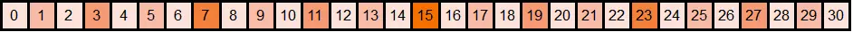
```

To optimize the memory layout and enhance cache efficiency, it is desirable to group hot elements (frequently accessed) together and cold elements (infrequently accessed) together.

To achieve this cache-friendly memory layout, I suggest renumbering the elements using a 500 years-old numeration - The Eytzinger Layout.

### Eytzinger Layout

According to Wiki:

> ***Michaël Eytzinger*** was an Austrian nobleman, diplomat, historian, and publicist, who wrote and published several works, including a renowned volume that states the principles of a genealogical numbering system, called an ***Ahnentafel***, that is still in use today.

In the Ahnentafel (German for "ancestor table") system, a person's direct ancestors are numbered in a fixed sequence of ascent. The person themselves is assigned the number 1, and their ancestors are numbered recursively. For each person with number $k$, their father is assigned the number $2k$, and their mother is assigned the number $(2k+1)$.

In computer science, this enumeration technique has found applications in various data structures, particularly in implicit (pointer-free) implementations of binary tree structures such as heaps and segment trees. Instead of storing names, these structures use the Ahnentafel numbering system to assign numbers to the underlying array items, enabling efficient traversal and manipulation of the tree structure.

Consider how the layout looks in our example:

```{r}
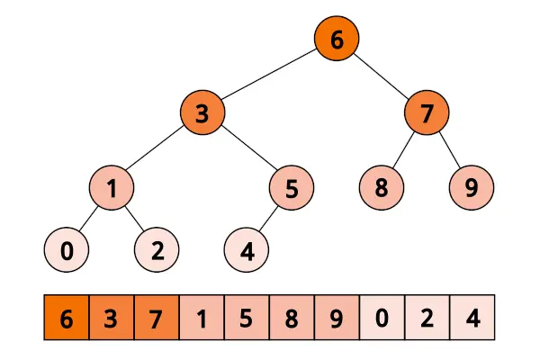
```

With this layout, we are easily to start from the first element, then jump to either $2 k$ or $(2k + 1)$:

```{r}
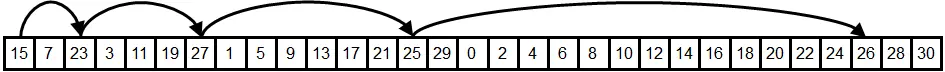
```

By reordering the elements of the array according to the Eytzinger layout, we can exploit the inherent structure of the binary tree and achieve optimal temporal locality. Elements closer to the root of the tree, which correspond to smaller numbers in the ahnentafel numbering, are placed closer to the beginning of the array. As a result, they are more likely to be fetched from the cache, leading to improved performance.

```{r}
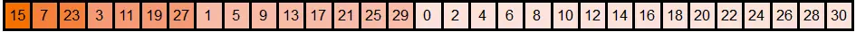
```

The process of reordering the elements using the Eytzinger layout follows a specific pattern. Even-indexed elements are written to the end of the new array, while the remaining elements are written in a similar manner, preserving their relative order within each level of the binary tree. The first element will be placed as the root of the tree.

#### Building the layout

To construct the layout, we can follow an article from [Codeforces](https://codeforces.com/blog/entry/75421), in $O(\log n)$ times:

```c++
// array: original sorted array
// eytzinger_array: 1-indexed array
// array_index will start from 0
// eytzinger_index will start from 1 (named as |k| in formula)
auto build_eytzinger_array(
  const std::vector<int32_t>& array,
  std::vector<int32_t>& eytzinger_array,
  size_t array_index,
  size_t eytzinger_index) -> size_t {
  if (eytzinger_index <= array.size()) {
    const auto eytzinger_index_x2 = eytzinger_index * 2;
    array_index                   = build_eytzinger_array(
      array,
      eytzinger_array,
      array_index,
      eytzinger_index_x2);

    eytzinger_array[eytzinger_index] = array[array_index];
    ++array_index;

    array_index = build_eytzinger_array(
      array,
      eytzinger_array,
      array_index,
      eytzinger_index_x2 + 1);
  }
  return array_index;
}
```

This function takes the current node number `eytzinger_index` and recursively constructs the Eytzinger array. It writes out the elements to the left of the middle of the search interval, then adds the current element for comparison, and finally writes out the elements to the right. Although it may appear complex at first glance, a few observations can help understand its functionality:

- It writes exactly `array.size()` elements, as the `if` block is entered once for each `eytzinger_index` ranging from `1` to `array.size()`.
- The elements from the original array are written sequentially, incrementing the `array_index` with each iteration.
- By the time the element at node `eytzinger_index` is written, all the elements to its left (up to `array_index`) have already been written.

Despite its recursive nature, the function is quite efficient due to the sequential memory reads and writes ($O(\log n)$ at a time). However, maintaining the permutation can be more challenging both conceptually and computationally. Unlike adding an element to a sorted array, which involves shifting a suffix of elements, the Eytzinger array needs to be rebuilt entirely.

Although the new layout may not be exactly equivalent to the "tree" structure of a standard binary search (For instance, the left child subtree may have a larger size than the right child subtree, potentially up to twice as large), this discrepancy does not significantly impact the overall performance, as both approaches still result in a binary search tree with a depth of approximately $\lceil \log_2 n \rceil$.

Additionally, it's worth mentioning that the Eytzinger array is 1-indexed, which holds importance for optimizing performance later. You can assign a value to the 0-th element to indicate the desired return value when the lower bound does not exist, like using `array.end()` for `std::lower_bound`.

#### Implement the Searching

Now, with the Eytzinger array and its optimized traversal, we can descend the array using only indices, eliminating the need to store and recalculate search boundaries. This efficient approach also allows us to avoid branching in our algorithm. Here's the code snippet:

```c++
// named as |k| in formula
size_t current_eytzinger_index = 1;
while (current_eytzinger_index <= array.size())
  current_eytzinger_index =
    2 * current_eytzinger_index + (eytzinger_array[k] < looking_for);
```

By starting with $k=1$ and updating it as $k = 2 * k + (eytzinger\\_array[k] < looking\\_for)$, we can navigate through the array efficiently, moving left if the current element is greater than or equal to $looking_for$, and right otherwise. The simplicity and lack of branching in this loop contribute to improved performance.

However, a challenge arises when we need to determine the index of the resulting element, as $k$ does not directly point to it. Let's consider an example to understand this issue (corresponding tree provided above):

<pre class='center-pre'>
    array:  0 1 2 3 4 5 6 7 8 9
eytzinger:  <u>6</u> <u>3</u> 7 <u>1</u> 5 8 9 0 <u>2</u> 4
1st range:  ------------?------  k := 2*k     = 2   (6 >= 3)
2nd range:  ------?------        k := 2*k     = 4   (3 >= 3)
3rd range:  --?----              k := 2*k + 1 = 9   (1 < 3)
4th range:      ?--              k := 2*k + 1 = 19  (2 < 3)
5th range:        !
</pre>

In this example, we query the array of $[0, ..., 9]$ for the lower bound of $x=3$. We compare $x$ against $[6, 3, 1, 2]$, proceeding with left-left-right-right steps until we end up with $k=19$. However, $k=19$ is not a valid array index.

By observing the flow, we can recognize that we can compare $x$ against it at some point unless the answer is the end of the array. Once we determine that the answer is not less than $x$, we make a left turn and then continue going right until we reach a leaf (as we only compare $x$ against lesser elements). Therefore, to restore the correct answer, "cancel" some right turns and then make one additional move.

A solution is to recognize that the right turns are recorded as 1-bits in the binary representation of $k$. Therefore, finding the number of trailing 1-bits then right-shifting $k$ by that number plus one is the way to restore the answer. This can be achieved by inverting the number (`~k`) and letting the `__builtin_ffs` (or its variants) come to play:

```c++
auto eytzinger_search(
  const std::vector<int32_t>& eytzinger_array,
  int32_t looking_for) -> int32_t {
  // named as |k| in formulas
  size_t current_index = 1;
  while (current_index < eytzinger_array.size()) {
    current_index =
      (current_index * 2) + (eytzinger_array[current_index] < looking_for);
  }
  current_index >>= __builtin_ffs(~current_index);
  return eytzinger_array[current_index];
}
```

Unfortunately, the result is quite sad:

```{r}
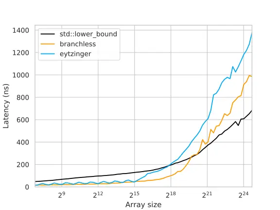
```

When comparing the latency of smaller arrays, the branchless binary search implementation and the Eytzinger Search exhibit similar performance. This similarity is expected since the branchless implementation is concise and efficient. However, as the array size increases, the performance of the Eytzinger Search lose the run.

The reason behind this performance difference lies in the loss of spatial locality in the Eytzinger Search. In the branchless implementation, the last 3-4 elements being compared are likely to reside in the same cache line, allowing for efficient memory access. However, in the Eytzinger layout, these last elements are no longer grouped together in a single cache line, resulting in separate memory fetches for each element.

One might argue that the improved temporal locality in the Eytzinger Search should compensate for the loss of spatial locality. Previously, only a fraction (approximately $\frac{1}{16}$) of the cache line was utilized to store a hot element, whereas now the entire cache line is used, effectively increasing the effective cache size by a factor of 16. This expanded cache size should enable covering approximately 4 more initial requests based on logarithmic calculations.

However, upon closer examination, it becomes apparent that this compensation is not sufficient. Caching the other 15 elements in the cache line was not entirely useless, and the hardware could have fetched neighboring cache lines in advance. If the last requests in the sequence were performed, the subsequent memory reads would likely involve accessing cached elements. Therefore, in reality, it is more likely that the last 6-7 accesses would benefit from caching, rather than just 3-4.

At first glance, it may seem that adopting the Eytzinger layout was an imprudent decision. However, let's spend our efforts to make it worthwhile.

#### On trying to prefetch

To mitigate the impact of memory latency in the Eytzinger Search, we can employ prefetching techniques similar to those used in the branchless binary search. However, in the case of this layout, we can optimize the prefetching process by leveraging the sequential nature of neighboring nodes in the array.

In the Eytzinger array, the left ($2k$) and right child nodes ($(2k + 1)$) of a given node, are likely to reside in the same cache line. This observation allows us to issue a single prefetch instruction for both child nodes, reducing the overhead associated with separate prefetches.

Let extends this observation further to the grand-children of node $k$, which are stored sequentially in the array. By examining the indices, we can deduce that the cache line containing these grand-children can also be fetched using a single instruction. Specifically, the indices $4k$, $4k + 1$, $4k + 2$, and $4k + 3$ correspond to the great-grandchildren of node $k$.

We can continue this pattern and prefetch even more descendants in advance. By fetching ahead as many as possible within a single cache line, we can prefetch up to $\frac{64}{4} = 16$ elements, which are the great-great-grandchildren of a node $k$, spanning indices from $16k$ to $(16k + 15)$.

To ensure that we retrieve all $16$ elements with a single memory request, we need to take cache line boundaries into consideration. By prefetching both the first and last element of this group, we increase the chance of capturing all of them. Crucially, we can exploit the fact that the index of the first element, $16k$, is divisible by $16$. Consequently, the memory address of this element will be the base address of the array plus a value divisible by $64$, which is also the cache line size.

Thus, if the array starts on a cache line boundary, we can guarantee that these $16$ elements will reside entirely within a single cache line.

Therefore, why not align the array by a magic $64$?

```c++
// 1-indexed
alignas(64) std::vector<int32_t> eytzinger_array(array.size() + 1);
```

And then prefetch the first in the group of $16k$ on every iteration:

```c++
auto eytzinger_search(
  const std::vector<int32_t>& eytzinger_array,
  int32_t looking_for) -> int32_t {
  // named as |k| in formulas
  size_t current_index = 1;
  while (current_index < eytzinger_array.size()) {
    __builtin_prefetch(eytzinger_array.data() + (current_index * 16));
    current_index =
      (current_index * 2) + (eytzinger_array[current_index] < looking_for);
  }
  current_index >>= __builtin_ffs(~current_index);
  return eytzinger_array[current_index];
}
```

And here is the result:

```{r}
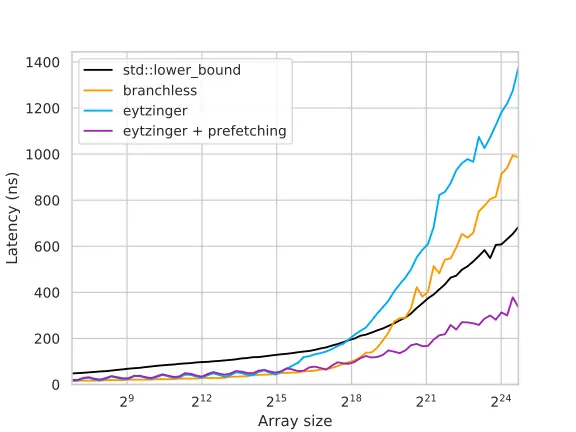
```

The performance improvement achieved by the prefetching technique in large arrays is quite significant, approximately 3-4 times faster compared to the previous version and around 2 times faster than `std::lower_bound`. This enhancement effectively hides memory latency by prefetching data four steps ahead and overlapping memory requests.

In theory, if computation was not a limiting factor, we would expect a speedup of approximately 4 times. However, in practice, the speedup is somewhat more moderate due to various factors.

Furthermore, it's worth considering prefetching beyond the 4 steps mentioned earlier. We can attempt to request only the first cache line and rely on the hardware to prefetch its neighboring cache lines. It's important to note that ***the effectiveness of this trick depends on the specific hardware in use, and it may or may not improve overall performance***.

Additionally, one should bear in mind that the prefetch requests may not be necessary (typically the last prefetch) and could potentially be invalid (out of the program allocated memory). Although modern CPUs treat these invalid instructions as no-ops (which means there are no slow-down problems), one should unroll the last few iterations out of the loop to eliminate unnecessary prefetches.

Finally, prefetching does come at a cost. It effectively trades excess memory bandwidth for reduced latency. Therefore, for instance, if you run multiple instances simultaneously on separate hardware threads, it can significantly impact the benchmark performance.

# References
